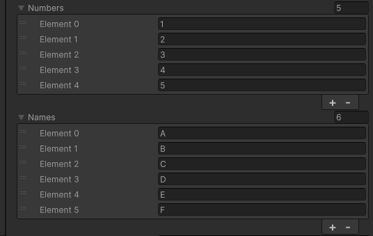
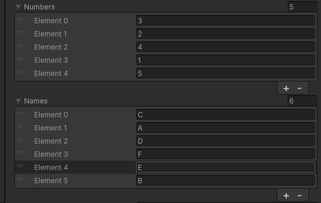

# 🔀 Unity Shuffle Extension

A lightweight **extension method** for shuffling **arrays** and **lists** in Unity

---

## 🚀 Features

- Shuffle **arrays** (`T[]`) and **lists** (`List<T>`) with a specified shuffle accuracy.
- Uses **C# extension methods** to provide a simple `.Shuffle()` call.
- Works seamlessly in **Unity** with the `Random.Range()` function.

---

### First One

### Second One

